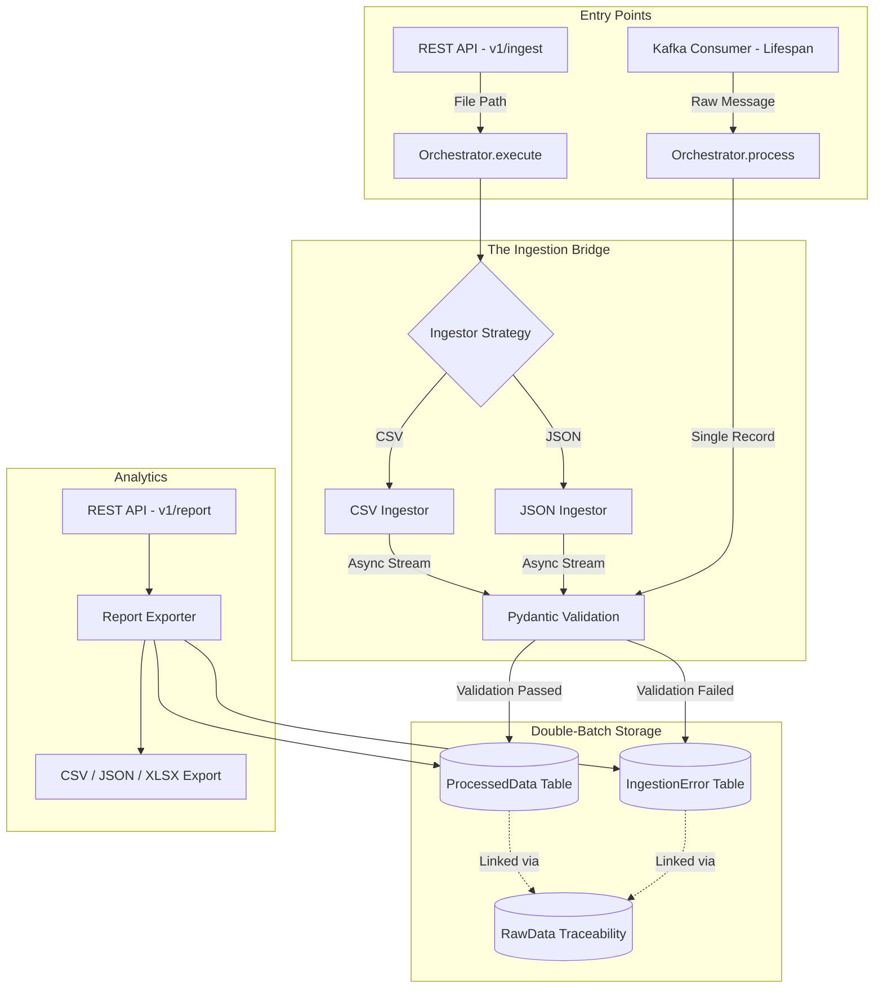

# High-Performance Data Reporting System

A robust, FastAPI-powered pipeline designed to ingest, validate, and report on large-scale datasets (100k+ records) with high efficiency.

The system provides a clear audit trail from raw input to validated output using a **Double-Batch persistence strategy**.

---

## 🏗️ Architecture Overview

The system utilizes a **Push-based Architecture** for files and a **Persistent Stream** for Kafka, ensuring high throughput and low resource idle-time.


📂 Project Structure
```text
reporting_system/
├── app/
│   ├── api/v1/          # Versioned Routers (Ingestion & Reporting domains)
│   ├── core/            # Orchestrator & Kafka Worker logic
│   ├── crud/            # Batch-optimized DB operations
│   ├── ingestors/       # Strategy pattern (CSV, JSON, Kafka)
│   ├── models/          # SQLAlchemy ORM Models
│   ├── schemas/         # Pydantic Validation
│   └── main.py          # Entry point & Lifespan Management
├── data/                # Sample datasets
├── README.md
└── reporting.db         # SQLite (WAL mode enabled)
```
🚀 API Reference
```text
All endpoints are versioned under /api/v1.
| Method | Endpoint                  | Description                      |
| ------ | ------------------------- | -------------------------------- |
| POST   | `/api/v1/ingest`          | Batch ingestion (CSV / JSON)     |
| GET    | `/api/v1/summary`         | Success/failure counts & metrics |
| GET    | `/api/v1/errors/{format}` | Export failed records            |
| GET    | `/api/v1/report/{format}` | Export validated dataset         |
```

🏗️ Key Engineering Patterns
```text
1. Hybrid Ingestion: Batch vs Stream

Ephemeral Ingestion (REST)
Handles point-in-time files. The process is bound to the HTTP request lifecycle.

Persistent Ingestion (Lifespan)
Kafka consumers are managed via FastAPI’s lifespan handler and run as non-blocking background tasks.

Dual Execution Pathways

execute() → High-throughput file processing via execute()

process() → and low-latency event processing via process()

2. The system acts as a persistence bridge between raw evidence and validated results:

Raw data captured immediately in RawData

db.flush() generates primary keys mid-transaction

Validated records linked before a single atomic commit()

Prevents orphaned or partially persisted data


3.Error Handling & Auditing

All validation failures are recorded in the IngestionError table, including:

Raw input payload

Structured validation errors

Pydantic error metadata

This ensures a complete audit trail for debugging and compliance.
4. Performance Optimization

Batch database operations using bulk inserts

SQLAlchemy 2.0 async session patterns

Non-blocking Kafka consumer

Indexed schema optimized for read/write throughput
5.The architecture is designed for horizontal scaling:

Multiple FastAPI instances

Kafka consumer replication

Migration from SQLite to PostgreSQL for production workloads
```

🛠️ Installation & Usage
```text
1. Clone the Repository
git clone https://github.com/tapan-paul/high-performance-reporting-system.git
cd high-performance-reporting-system
python -m venv venv
source venv/bin/activate
pip install -r requirements.txt

2. Run the Application
uvicorn app.main:app --reload

3. Swagger UI
http://127.0.0.1:8000/docs


4. Ingest Example
python gen_large_data.py

curl -X POST \
"http://127.0.0.1:8000/api/v1/ingest?file_path=large_data.csv&source_type=csv"


5. Get Summary
curl -X GET \
"http://127.0.0.1:8000/api/v1/summary"
```

📊  Results
```text
Successful Crossings: 6,065 records persisted to ProcessedData

Blocked Entries: 3,935 records redirected to IngestionError

Full Audit Trail: curl -o error_report.csv \
"http://127.0.0.1:8000/api/v1/errors/csv"
```

🚀 Future Improvements
```text
Observability: Prometheus + Grafana

Horizontal scaling with PostgreSQL

dbt for analytical transformations

While the current version focuses on high-performance data exports (CSV, JSON, XLSX), the system is architected to support **Human-Readable Templating** via a decoupled presentation layer.

* **Data-to-Template Mapping**: The `ReportExporter` is designed to feed sanitized Pydantic schemas into templating engines like **Jinja2** or **ReportLab**.
* **Decoupled Design**: By separating the raw data retrieval from the formatting logic, the system can generate branded HTML summaries or PDF invoices without modifying the core ingestion orchestrator.
* **Extensibility**: To implement a new visual template, one simply needs to add a new `TemplateStrategy` to the Reporting Layer, ensuring the system remains OCP (Open-Closed Principle) compliant.

```
🤖 AI-Assisted Development (AIDD)
```text
This project was developed using a human-in-the-loop AI collaboration model, where Generative AI acted as a senior architectural peer.

Strategic Contributions

Bridge Pattern for ingestion/persistence decoupling

Optimized SQLAlchemy async flush() workflow

Designed the Dead Letter Office pattern
```

